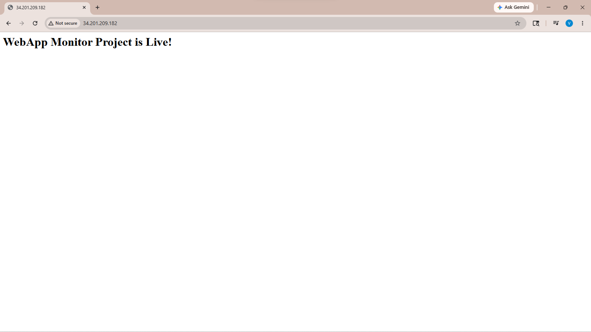
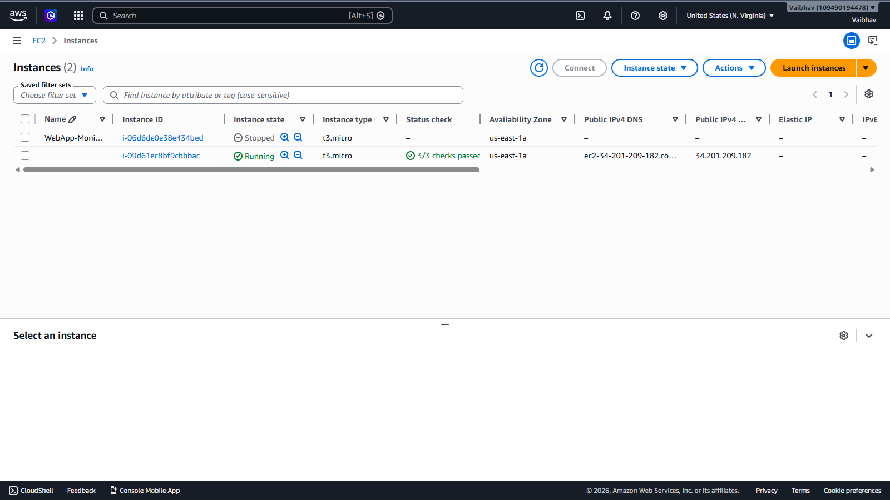
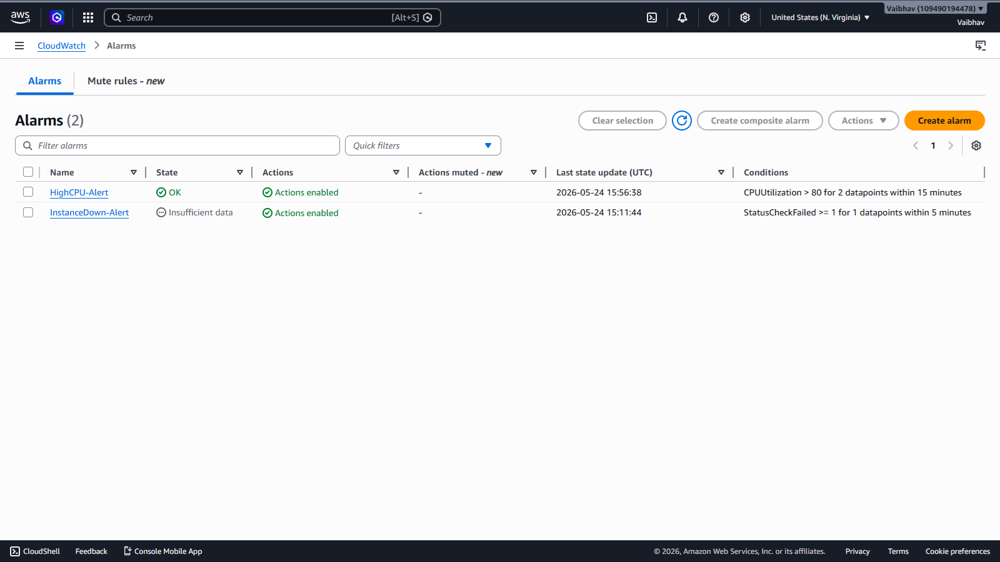
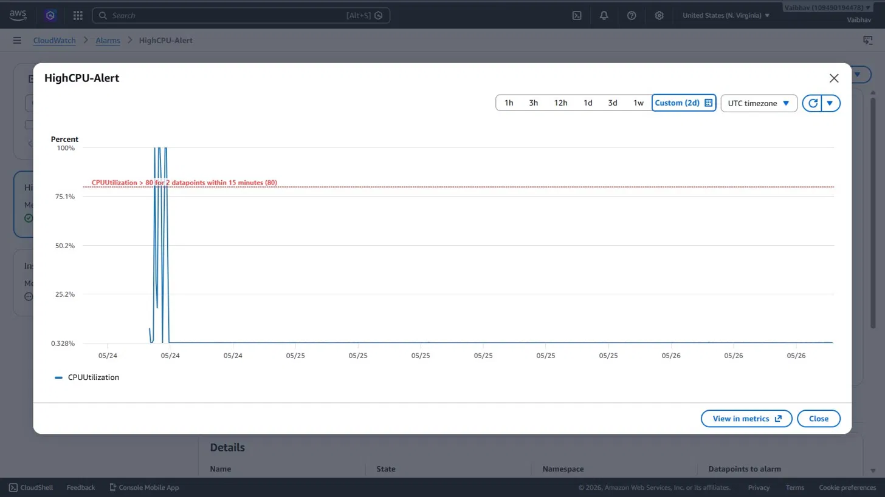
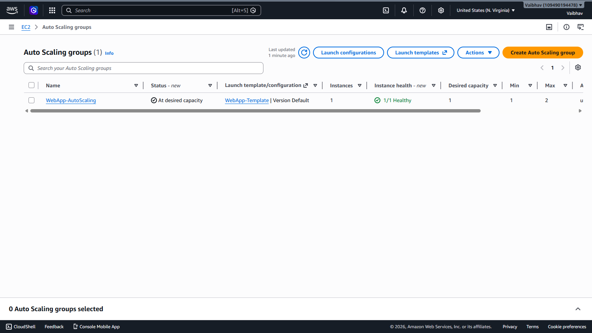
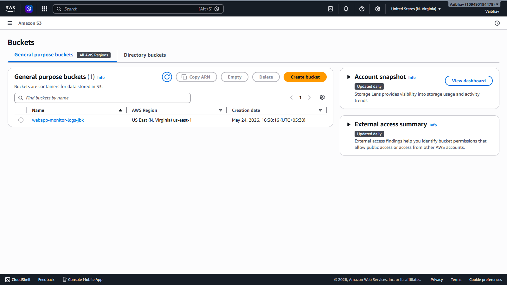
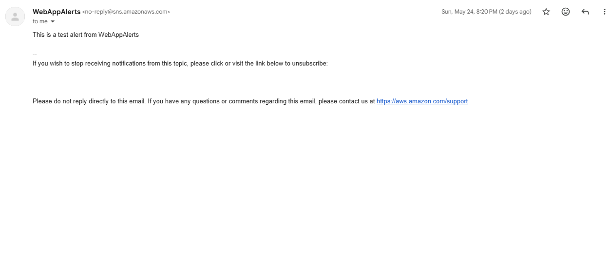
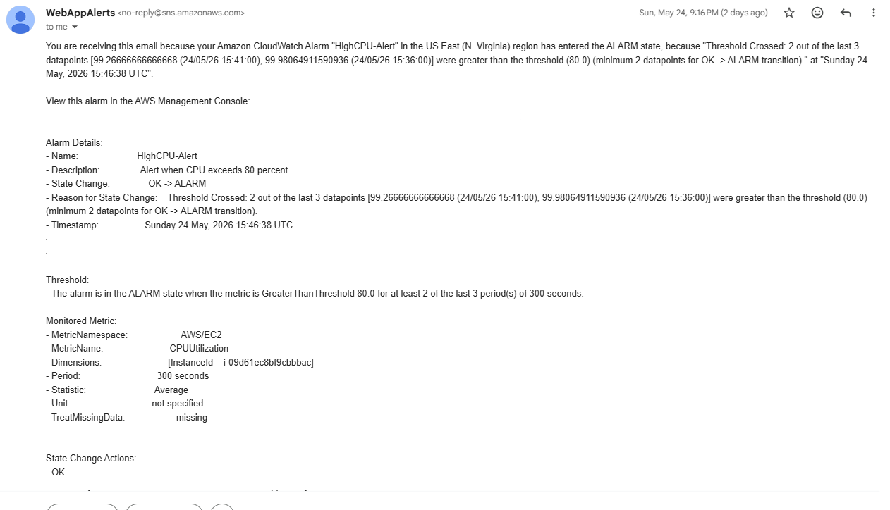

# AWS Web App Monitor & Auto-Recovery System

A production-grade AWS monitoring system that hosts a web application on EC2 and automatically recovers if it goes down.

## AWS Services Used

| Service | Purpose |
|---|---|
| EC2 | Hosts the web application |
| CloudWatch | Monitors CPU, memory and logs |
| SNS | Sends email alerts |
| CloudWatch Alarms | Triggers on high CPU or instance down |
| IAM | Roles and permissions |
| S3 | Stores application logs |
| Auto Scaling | Automatically recovers if EC2 goes down |

## Architecture Overview

- EC2 t3.micro running Apache web server
- CloudWatch Agent monitoring CPU and memory metrics
- Two alarms: HighCPU-Alert and InstanceDown-Alert
- Auto Scaling Group with Min:1, Desired:1, Max:2
- SNS email notifications triggered on alarm

## Screenshots

### Web Server Live

### EC2 Instance Running

### CloudWatch Alarms

### CPU Spike Graph (98.9% during stress test)

### Auto Scaling Group

### S3 Bucket for Logs

### SNS Test Alert Email Received

### HighCPU Alert Email Received

## Project Structure

- README.md
- scripts/userdata.sh
- scripts/cloudwatch-agent-config.json
- architecture/architecture-notes.md
- screenshots/

## Setup Steps

### Step 1 - IAM Role
- Create role named EC2MonitorRole
- Attach CloudWatchAgentServerPolicy
- Attach CloudWatchLogsFullAccess
- Attach AmazonS3FullAccess

### Step 2 - EC2 Instance
- AMI: Amazon Linux 2023
- Instance type: t3.micro
- Attach IAM role EC2MonitorRole
- Add User Data script to install Apache

### Step 3 - CloudWatch Agent
- Install amazon-cloudwatch-agent on EC2
- Configure metrics for CPU and memory
- Configure logs for Apache access log
- Start and enable the agent

### Step 4 - S3 Bucket
- Create bucket for storing application logs
- Sync logs from EC2 every 5 minutes

### Step 5 - SNS Alerts
- Create SNS topic named WebAppAlerts
- Add email subscription
- Confirm subscription via email

### Step 6 - CloudWatch Alarms
- HighCPU-Alert: triggers when CPU exceeds 80%
- InstanceDown-Alert: triggers when StatusCheckFailed >= 1

### Step 7 - Auto Scaling
- Create Launch Template from EC2 configuration
- Create Auto Scaling Group
- Min: 1, Desired: 1, Max: 2
- Health check type: EC2
- Health check grace period: 120 seconds

## Tests Performed

- ✅ Web server live and accessible via public IP
- ✅ SNS test alert email received successfully
- ✅ Auto Scaling launched new instance automatically when EC2 stopped
- ✅ CPU stress test reached 99.26% triggering HighCPU alarm
- ✅ CloudWatch alarm email received with full details

## How Auto Recovery Works

1. EC2 instance goes down
2. Auto Scaling detects health check failure
3. Auto Scaling terminates unhealthy instance
4. Auto Scaling launches fresh replacement instance
5. New instance runs User Data script automatically
6. Web server is back online without manual intervention

## How Monitoring Works

1. CloudWatch Agent runs on EC2
2. Collects CPU, memory and disk metrics every 5 minutes
3. Sends metrics to CloudWatch namespace MyWebApp
4. CloudWatch Alarms evaluate metrics against thresholds
5. When threshold breached alarm triggers SNS notification
6. SNS sends email alert to subscribed email address

## Author

Vaibhav - AWS Cloud Project 2026
